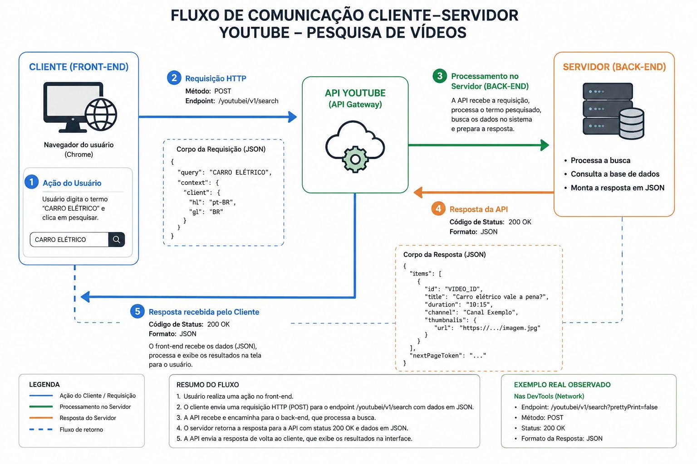

# 🔎 Análise de Arquitetura Web – YouTube

## 📌 Sobre o projeto

Este projeto apresenta uma análise prática da arquitetura cliente-servidor de uma aplicação web, utilizando o YouTube como objeto de investigação.

A análise foi realizada por meio das ferramentas de desenvolvedor do navegador (DevTools), com foco na aba **Network**, permitindo observar o tráfego de dados entre o navegador e os servidores da aplicação.

## 🎯 Objetivos

- Identificar requisições HTTP relevantes;
- Analisar métodos HTTP utilizados pela aplicação;
- Observar endpoints e códigos de status;
- Analisar Headers, Payload e Response;
- Compreender o papel das APIs na comunicação cliente-servidor;
- Identificar estruturas de dados JSON;
- Documentar o fluxo de comunicação entre Front-end e Back-end.

## 🛠️ Tecnologias e ferramentas

- 🌐 Navegador Web
- 🛠️ Chrome DevTools
- 📡 HTTP / HTTPS
- 🔌 APIs
- 📦 JSON
- 🖥️ Arquitetura Cliente-Servidor
- 🐙 GitHub

## 🔬 Metodologia

A investigação foi realizada utilizando a aba **Network** das ferramentas de desenvolvedor.

Durante a análise foram observadas diferentes requisições geradas pela aplicação, considerando:

- Endpoint;
- Método HTTP;
- Código de status;
- Request Headers;
- Response Headers;
- Payload;
- Response;
- Comunicação entre cliente e servidor.

## 📊 Evidências da análise

As evidências coletadas durante a investigação estão disponíveis na pasta [`prints`](./prints/).

### 01 – Pesquisa – Headers

### 02 – Pesquisa – Payload

### 03 – Pesquisa – Response JSON

### 04 – Reprodução de vídeo – Headers

### 05 – Playback – Headers

### 06 – Watchtime – Headers

### 07 – Generate 204 – Headers

## 🏗️ Arquitetura analisada

O fluxo observado segue o modelo tradicional de comunicação cliente-servidor:

**Usuário → Front-end → API/Servidor → Processamento → Resposta HTTP → Front-end**

Durante a investigação foram identificadas requisições utilizando diferentes métodos HTTP e códigos de status, demonstrando como uma aplicação web moderna realiza comunicação constante com seus servidores.

## 📚 Aprendizados

A experiência permitiu desenvolver conhecimentos práticos sobre:

- Arquitetura cliente-servidor;
- Comunicação HTTP;
- APIs;
- JSON;
- Headers;
- Payloads;
- Status Codes;
- Análise de tráfego de rede;
- Uso das ferramentas DevTools;
- Documentação técnica.

- ## 🖼️ Fluxograma da arquitetura

O fluxograma abaixo representa o fluxo de comunicação entre o cliente (Front-end), a API e o servidor (Back-end), destacando as principais etapas da requisição e resposta HTTP.

## 📸 Evidências da análise

Durante a análise foram coletadas evidências utilizando as ferramentas de desenvolvedor do navegador (DevTools), especialmente a aba Network.

### 01 — Pesquisa de vídeos: Headers

Registro dos cabeçalhos HTTP observados durante a pesquisa de vídeos.

### 02 — Pesquisa de vídeos: Payload

Registro do corpo da requisição enviada pelo cliente.

### 03 — Pesquisa de vídeos: Response JSON

Registro da estrutura JSON retornada pela aplicação.

### 04 — Reprodução de vídeo: Headers

Análise dos cabeçalhos envolvidos na reprodução do vídeo.

### 05 — Playback: Headers

Análise da comunicação relacionada ao processo de playback.

### 06 — Watchtime: Headers

Análise da requisição relacionada ao acompanhamento do tempo de reprodução.

### 07 — Generate 204: Headers

Registro de uma requisição utilizada durante a comunicação da aplicação.

## 📋 Resumo das evidências

| Nº | Análise | Evidência |
|---|---|---|
| 01 | Pesquisa de vídeos | Headers |
| 02 | Pesquisa de vídeos | Payload |
| 03 | Pesquisa de vídeos | Response JSON |
| 04 | Reprodução de vídeo | Headers |
| 05 | Playback | Headers |
| 06 | Watchtime | Headers |
| 07 | Generate 204 | Headers |

## 👨‍💻 Autor

**João Moreira**

Projeto desenvolvido como parte de uma experiência prática de análise de arquitetura web.
